# 🐧 Linux Networking Lab
### Inter-Network Communication Using a Linux Router

> A hands-on VirtualBox lab demonstrating IP routing between two isolated subnets — no physical hardware required.

---


---

## 🧭 Project Overview

This lab project demonstrates how two virtual machines on **different subnets** can communicate with each other through a **Linux-based router** — all without any physical hardware. Everything is built inside VirtualBox using internal networks and static IP configuration.

**Core concepts covered:**

| Concept | Description |
|--------|-------------|
| 📌 IP Addressing | Assigning static IPs to each VM on separate /24 subnets |
| 🔀 Subnetting | Isolating two networks — 192.168.1.0/24 and 192.168.2.0/24 |
| 🚪 Default Gateway | Configuring each host to route unknown traffic to the router |
| 📦 Packet Flow | Tracing ICMP packets hop by hop across network boundaries |
| ⚡ IP Forwarding | Enabling kernel-level packet forwarding on the Linux router |

---

## 🗺️ Lab Topology

The lab uses **three VirtualBox VMs** connected via internal networks. The router sits between the two subnets and forwards packets between them.

```
┌─────────────────┐          ┌──────────────────┐          ┌──────────────────┐
│  Deep's Machine │          │      Router       │          │ Mohan's Machine  │
│  192.168.1.2    │◄────────►│ G0/0: 192.168.1.1│◄────────►│  192.168.2.2     │
│  (intnet1)      │          │ G0/1: 192.168.2.1│          │  (intnet2)       │
└─────────────────┘          └──────────────────┘          └──────────────────┘
  Network 1                                                   Network 2
  192.168.1.0/24                                             192.168.2.0/24
```

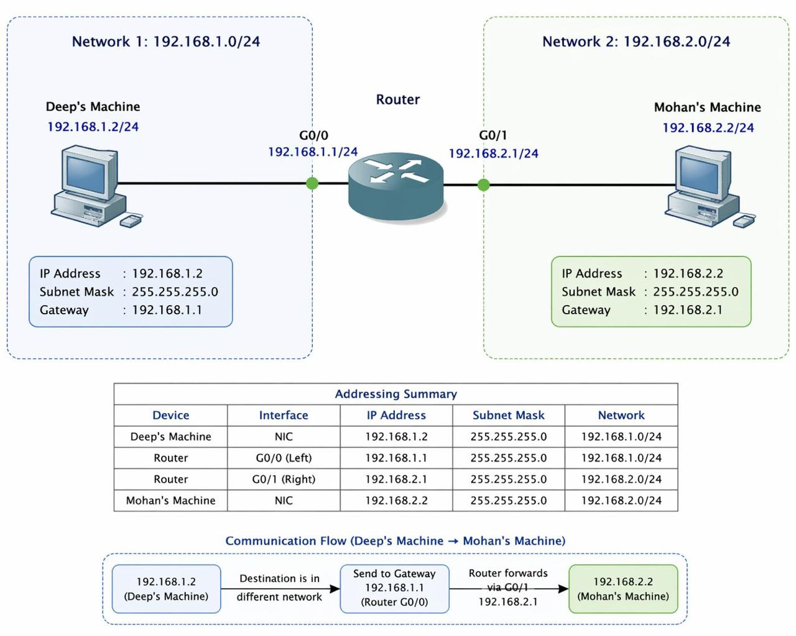

---

## ⚙️ Configuration Steps

### 🖥️ Deep's Machine (192.168.1.2/24)

Assigned to internal network **intnet1**, mapped to interface `enp0s3`. A NetworkManager connection profile was created with a static IP address and default gateway pointing to the router's G0/0 interface.

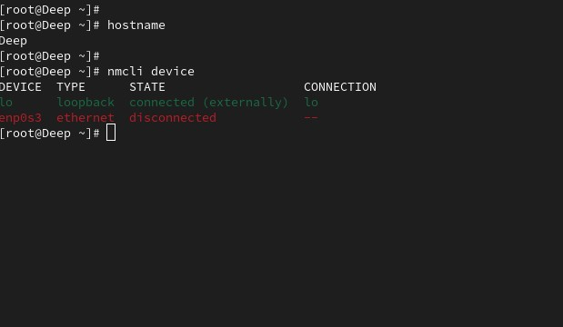

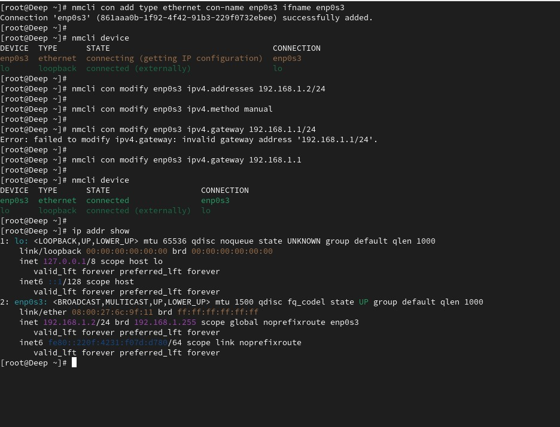

---

### 🖥️ Mohan's Machine (192.168.2.2/24)

Assigned to internal network **intnet2**, mapped to interface `enp0s3`. Configured identically to Deep's machine but on the second subnet — default gateway points to the router's G0/1 interface.

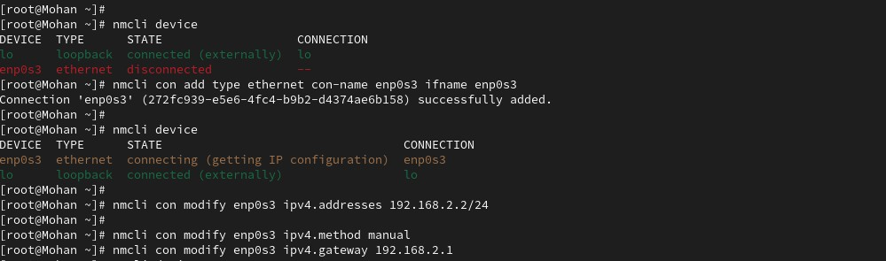

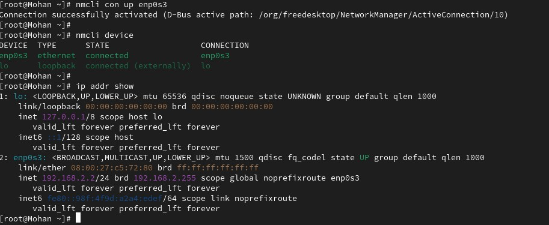

---

### 🛜 Router Configuration

The router VM has **two NICs** — one connected to each internal network. Two separate NetworkManager profiles were created, one for each interface (`enp0s3` and `enp0s8`).

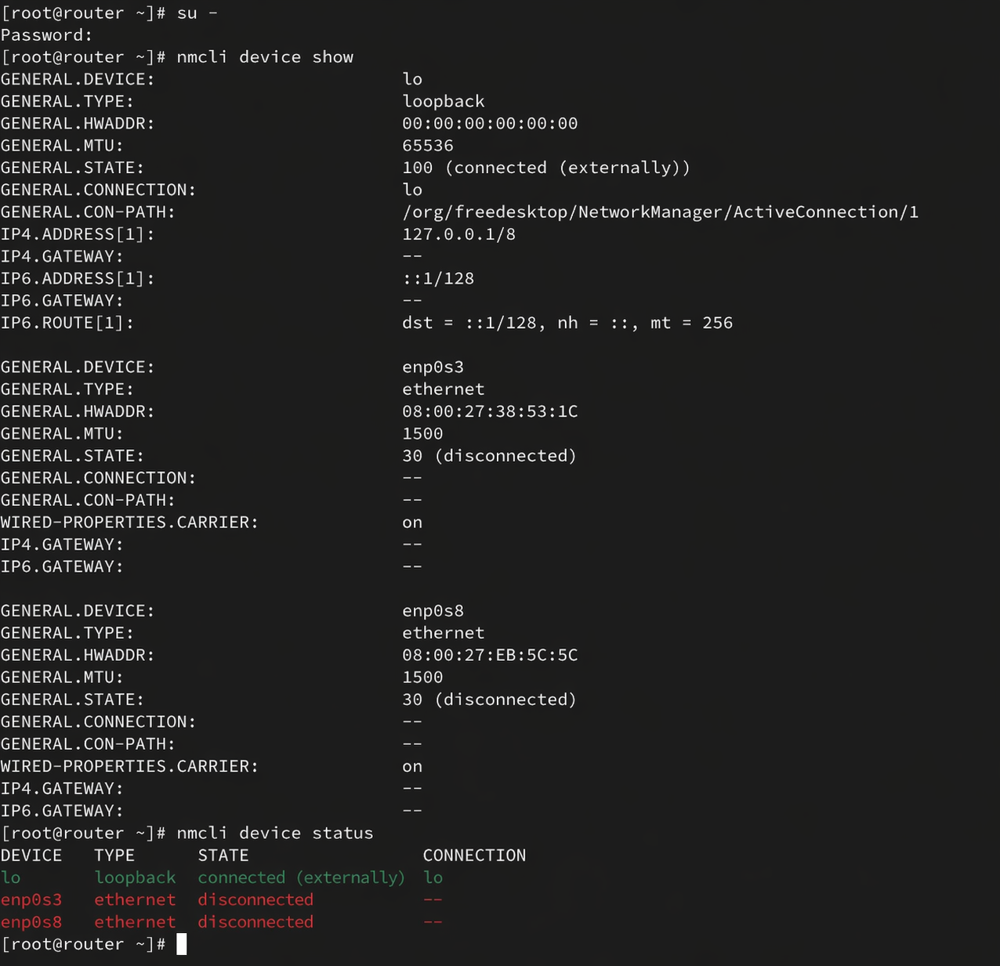

Separate network profiles were configured for both interfaces with static IPs on each subnet:

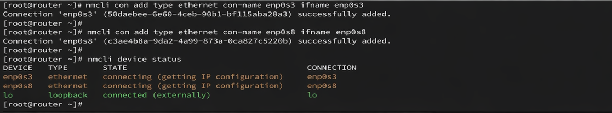

After bringing both connections up, IP forwarding was enabled so the router actually routes packets rather than dropping them:

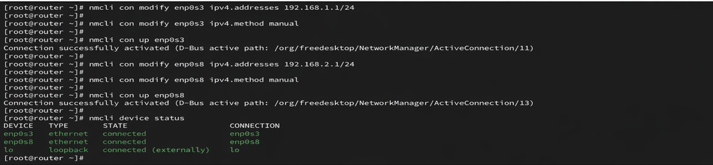

IP forwarding is the key that turns this Linux VM into a router. The `sysctl` command writes a `1` to `net.ipv4.ip_forward`, allowing packets destined for other networks to be forwarded:

```bash
echo "net.ipv4.ip_forward = 1" >> /etc/sysctl.conf
```

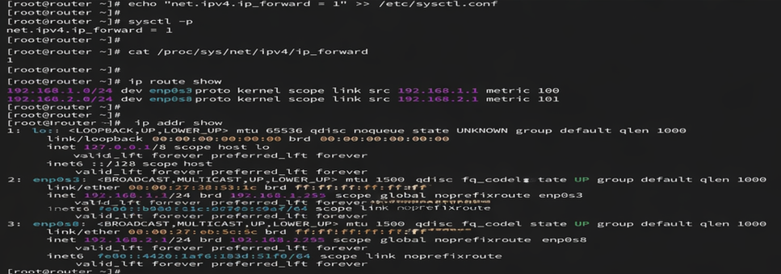

---

## ✅ Verification & Results

After completing all configuration steps, end-to-end connectivity was verified using **ICMP ping tests** in both directions.

### 🔍 Ping Test — Deep → Mohan (192.168.2.2)

```bash
ping 192.168.2.2
```

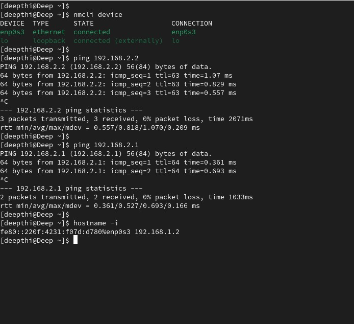

### 🔍 Ping Test — Mohan → Deep (192.168.1.2)

```bash
ping 192.168.1.2
```

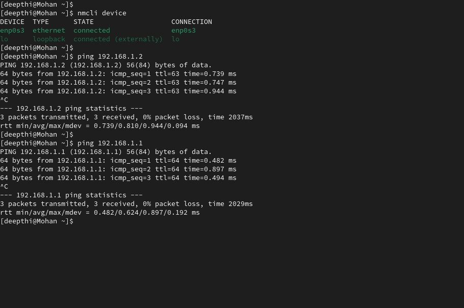

> ✅ Both directions successful. Zero packet loss. Full inter-network communication confirmed.

---

## 📦 Packet Flow Explained

Here's what happens under the hood every time a ping packet travels from Deep's Machine to Mohan's Machine:

```
Step 1 → VM1 (192.168.1.2) creates an ICMP Echo Request for 192.168.2.2
Step 2 → 192.168.2.2 is outside VM1's /24 subnet → packet sent to default gateway (192.168.1.1)
Step 3 → Router receives packet on enp0s3 (G0/0) → checks routing table
Step 4 → Routing table: 192.168.2.0/24 is directly connected via enp0s8 (G0/1)
Step 5 → Router forwards packet out of G0/1 → reaches VM2 (192.168.2.2)
Step 6 → VM2 sends ICMP Echo Reply → follows the reverse path back to VM1
```

---

## 🎓 Skills Demonstrated

| Skill | Tools / Concepts |
|-------|-----------------|
| 🐧 Linux Networking | `nmcli`, `ip addr`, `sysctl`, network profiles |
| 🛜 IP Routing | Static routes, routing table, IP forwarding |
| 📡 Subnetting | CIDR notation, /24 networks, address planning |
| 🔎 Troubleshooting | `ping`, connectivity verification, packet tracing |
| 💻 VirtualBox | Internal networks, multi-NIC VM setup |
| 📦 Packet Analysis | ICMP flow, hop-by-hop packet walkthrough |

---

## 👥 Built By

| | |
|--|--|
| **Deepthi** | [LinkedIn](https://www.linkedin.com/in/deepthi-karnatakapu/) |
| **Mohan Raj** | [LinkedIn](https://www.linkedin.com/in/amraj1231/) |

---

> *This is the same concept behind cloud VPCs, enterprise networks, and every router you've ever used — just distilled into three VMs on a laptop.* 🚀
